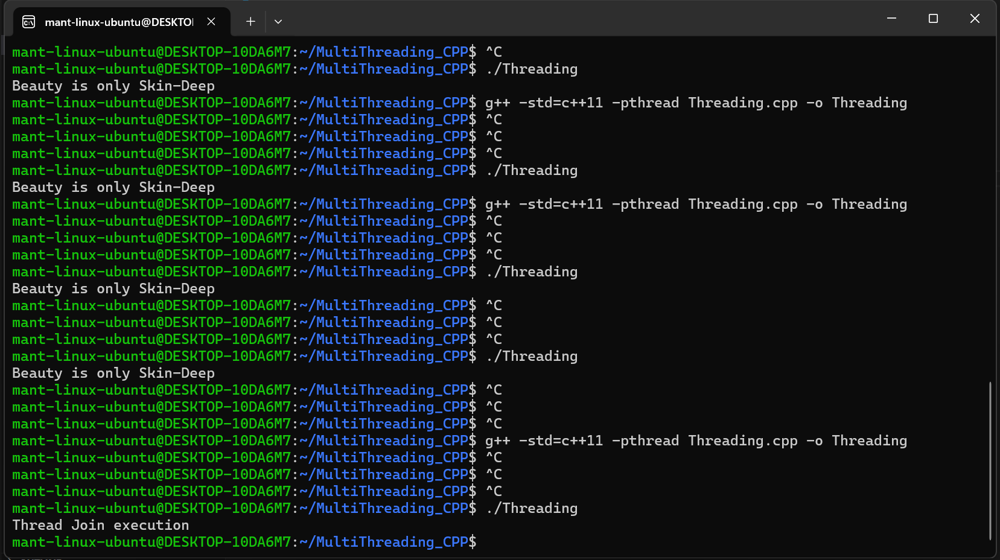
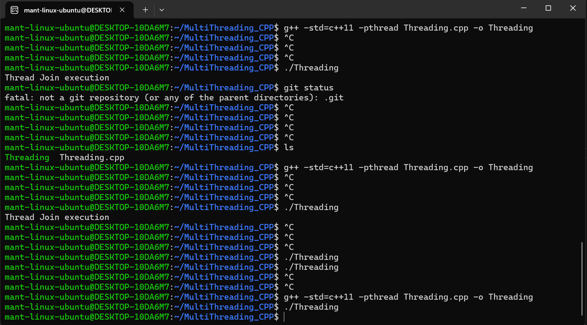
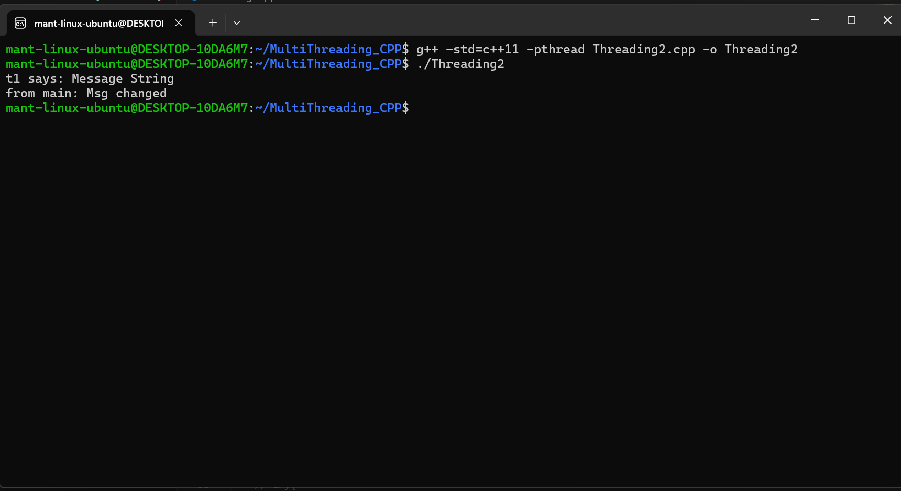
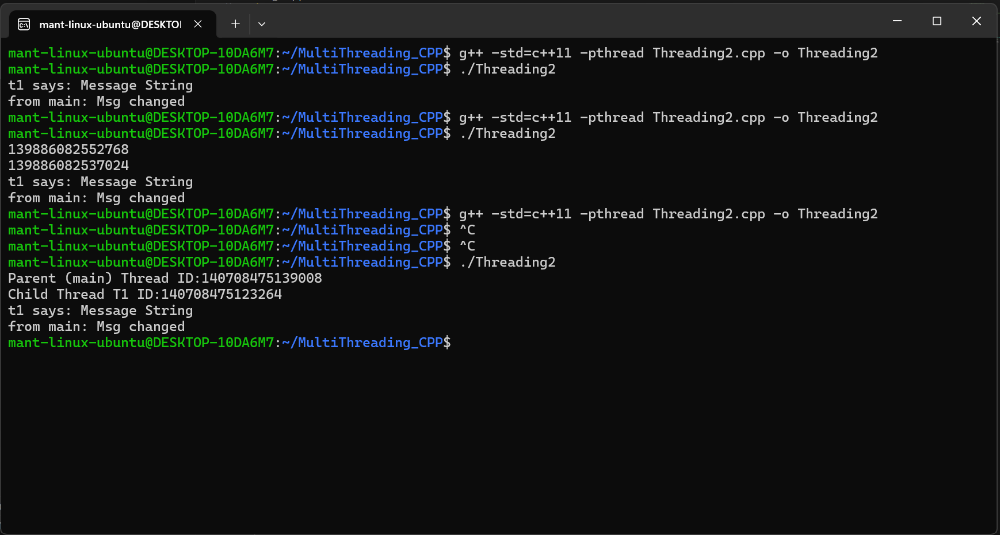
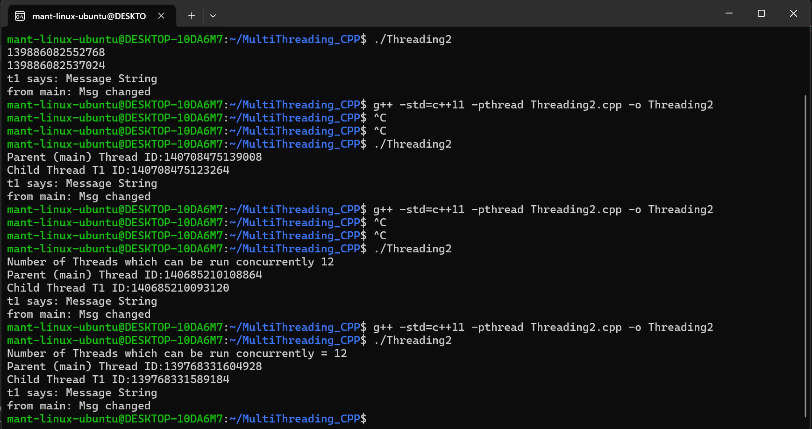
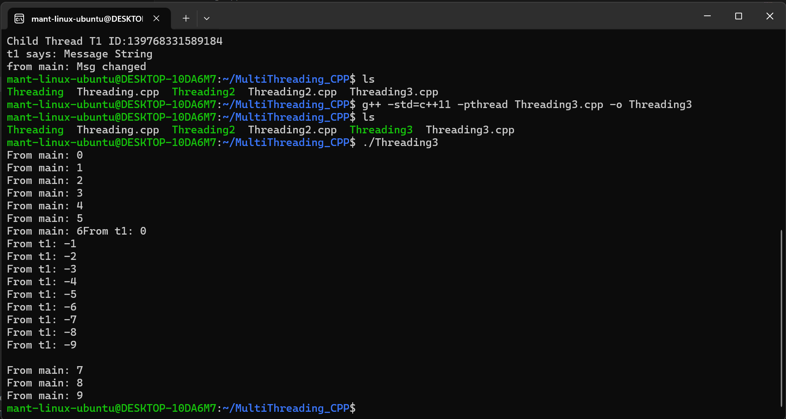
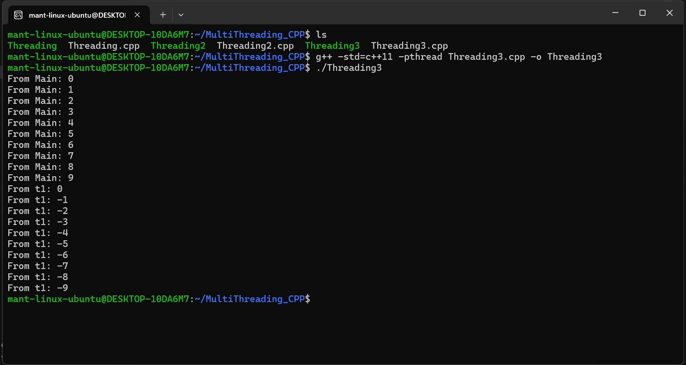

# MultiThreading CPP

## Thread Join

## Thread Detached

## Thread Joining After Detaching : Not Possible

## Thread Pass by Reference

## Thread ID

## Thread_Available_For_Concurrency_Support

## Thread-Data-Race

## Thread-Mutex

